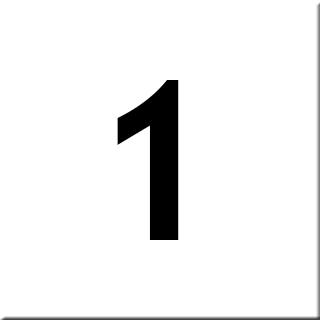
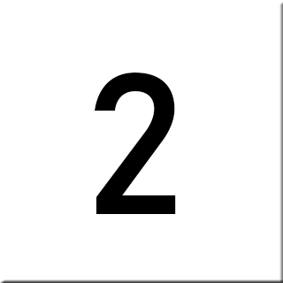
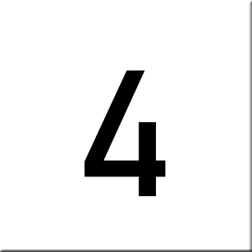
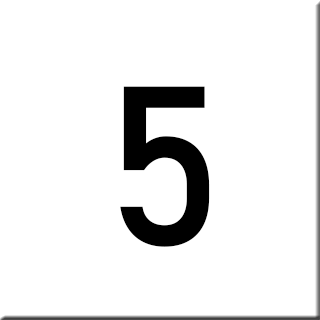
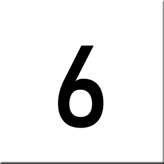
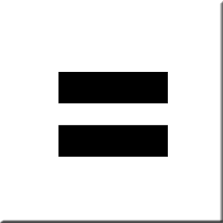

<!DOCTYPE html>
<html>

<link rel="stylesheet" href="style.css">

<body>

    

    
    
    
    
    
    
    
    
    
    
    
    
    
    
    
    
    
    <textarea id="ResultScreen" readonly></textarea>

</body>

</html>